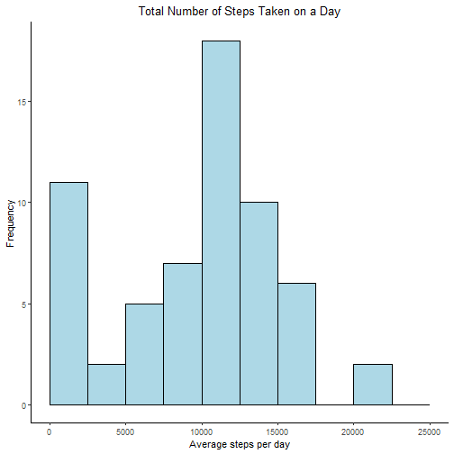
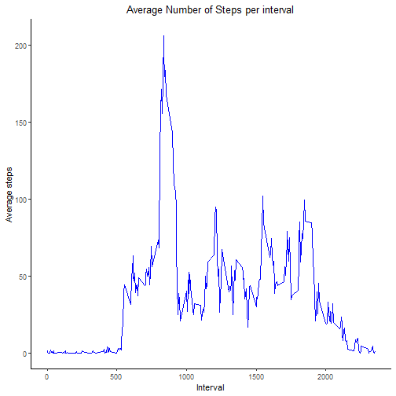
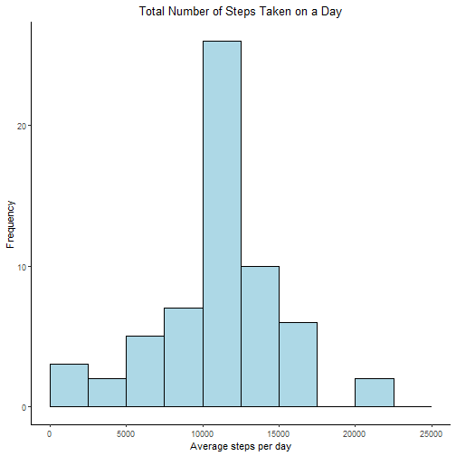
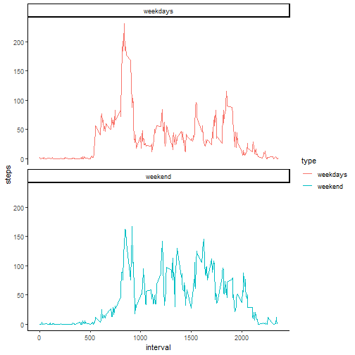

## Markdown setup


## Library


``` r
lib <- c("dplyr", "ggplot2")
for(i in lib){
if (!requireNamespace(i, quietly = TRUE)) {
  install.packages(i)
}}
library(dplyr)
```

```
## 
## 다음의 패키지를 부착합니다: 'dplyr'
```

```
## The following objects are masked from 'package:stats':
## 
##     filter, lag
```

```
## The following objects are masked from 'package:base':
## 
##     intersect, setdiff, setequal, union
```

``` r
library(ggplot2)
```

## Loading and preprocessing the data


``` r
if (!file.exists("activity.csv")) {
  fileUrl <- "https://d396qusza40orc.cloudfront.net/repdata%2Fdata%2Factivity.zip"
  download.file(fileUrl, destfile = "repdata_data_activity.zip")
  unzip("repdata_data_activity.zip")
}

data <- read.csv("./activity.csv",
                 header = TRUE)
```

Structure and summary of dataset:

``` r
print(str(data))
```

```
## 'data.frame':	17568 obs. of  3 variables:
##  $ steps   : int  NA NA NA NA NA NA NA NA NA NA ...
##  $ date    : chr  "2012-10-01" "2012-10-01" "2012-10-01" "2012-10-01" ...
##  $ interval: int  0 5 10 15 20 25 30 35 40 45 ...
## NULL
```

``` r
print(summary(data))
```

```
##      steps            date              interval     
##  Min.   :  0.00   Length:17568       Min.   :   0.0  
##  1st Qu.:  0.00   Class :character   1st Qu.: 588.8  
##  Median :  0.00   Mode  :character   Median :1177.5  
##  Mean   : 37.38                      Mean   :1177.5  
##  3rd Qu.: 12.00                      3rd Qu.:1766.2  
##  Max.   :806.00                      Max.   :2355.0  
##  NA's   :2304
```


## What is mean total number of steps taken per day?

Aggregate steps by date:

``` r
total_steps <- with(data, 
                    aggregate(steps, by = list(date), sum, na.rm = TRUE))
names(total_steps) <- c("date", "steps")
```


Histogram using ggplot:

``` r
hist <- ggplot(aes(x = steps),
               data = total_steps) +
  geom_histogram(breaks = seq(0, 25000, by = 2500),
                 fill = "lightblue", col = "black") +
  ggtitle("Total Number of Steps Taken on a Day") +
  xlab("Average steps per day") +
  ylab("Frequency") +
  theme_classic() +
  theme(plot.title = element_text(hjust = 0.5))
print(hist)
```



Median number of steps taken each day:

``` r
median(total_steps$steps)
```

```
## [1] 10395
```

Mean number of steps taken each day:

``` r
mean(total_steps$steps)
```

```
## [1] 9354.23
```


## What is the average daily activity pattern?

Aggregate steps by interval:

``` r
interval_steps <- with(data, 
                       aggregate(steps, by = list(interval), 
                                 mean, na.rm = TRUE))
names(interval_steps) <- c("interval", "steps")
```


Line graph with ggplot:

``` r
plot <- ggplot(aes(x = interval, y = steps),
               data = interval_steps) +
  geom_line(col = "blue") +
  ggtitle("Average Number of Steps per interval") +
  xlab("Interval") +
  ylab("Average steps") +
  theme_classic() +
  theme(plot.title = element_text(hjust = 0.5))
print(plot)
```




Interval with maximum number of average steps:

``` r
interval_steps[which.max(interval_steps$steps),]$interval
```

```
## [1] 835
```


## Imputing missing values

Total number of missing values in the dataset:

``` r
sum(is.na(data$steps))
```

```
## [1] 2304
```

Impute missing value as mean of average steps per interval:

``` r
data_impute <- data %>% 
  left_join(interval_steps, by = "interval") %>% 
  mutate(steps = ifelse(is.na(steps.x), steps.y, steps.x)) %>% 
  select(-steps.x, -steps.y)
```


Aggregate steps by date:

``` r
total_steps2 <- with(data_impute, 
                     aggregate(steps, by = list(date), sum, na.rm = TRUE))
names(total_steps2) <- c("date", "steps")
```

Plot a histogram with ggplot:

``` r
hist2 <- ggplot(aes(x = steps),
               data = total_steps2) +
  geom_histogram(breaks = seq(0, 25000, by = 2500),
                 fill = "lightblue", col = "black") +
  ggtitle("Total Number of Steps Taken on a Day") +
  xlab("Average steps per day") +
  ylab("Frequency") +
  theme_classic() +
  theme(plot.title = element_text(hjust = 0.5))
print(hist2)
```



Median number of steps taken each day:

``` r
median(total_steps2$steps)
```

```
## [1] 10766.19
```

Mean number of steps taken each day:

``` r
mean(total_steps2$steps)
```

```
## [1] 10766.19
```

Compared to the estimates from the first part of the assignment, imputing missing value increases mean and median of total number of steps per day


## Are there differences in activity patterns between weekdays and weekends?

Create a new factor variables indicating weekday or weekend:

``` r
data_impute <- data_impute %>% 
  mutate(type = ifelse(weekdays(as.Date(date)) %in% c("Saturday", "Sunday"),
                       "weekend", "weekdays")) %>% 
  mutate(type = factor(type, levels = c("weekdays", "weekend")))
```


Aggregate steps by interval:

``` r
interval_steps2 <- with(data_impute, 
                       aggregate(steps, by = list(interval, type), 
                                 mean, na.rm = TRUE))
names(interval_steps2) <- c("interval", "type", "steps")
```


Pannel plot with ggplot:

``` r
plot2 <- ggplot(aes(x = interval, y = steps, col = type),
               data = interval_steps2) +
  geom_line() +
  facet_wrap(~ type, ncol = 1, nrow = 2) +
  theme_classic()
print(plot2)
```


